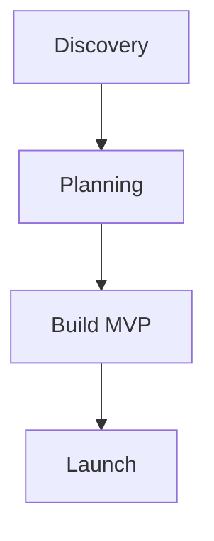
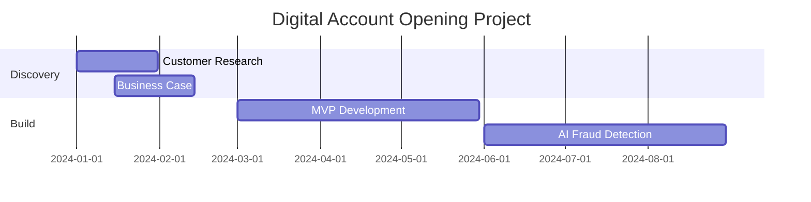

# Presenting Your Work: Tools & Portfolio Strategy


## Part 1: Tools for Creating Diagrams

### **Free & Accessible Tools**

**1. Mermaid (My Top Recommendation for You)**
- **Why:** Text-based diagrams that render beautifully, works in Markdown, GitHub native support
- **Use for:** All diagram types - flowcharts, sequence diagrams, Gantt charts, user journeys
- **Learning curve:** Low - simple syntax
- **Portfolio benefit:** Shows technical literacy, version-controllable
- **Example:**

- **Resources:** https://mermaid.js.org/

**2. Draw.io (diagrams.net)**
- **Why:** Free, powerful, no account needed, exports to many formats
- **Use for:** Architecture diagrams, flowcharts, BPMN, UML
- **Learning curve:** Low-medium
- **Portfolio benefit:** Professional-looking diagrams
- **Tip:** Integrates with GitHub, Google Drive, VS Code
- **URL:** https://app.diagrams.net/

**3. Excalidraw**
- **Why:** Hand-drawn style, collaborative, open-source
- **Use for:** Sketchy/conceptual diagrams, brainstorming visuals
- **Learning curve:** Very low
- **Portfolio benefit:** Shows ideation and thinking process
- **URL:** https://excalidraw.com/

**4. PlantUML**
- **Why:** Text-based UML diagrams, great for technical documentation
- **Use for:** Sequence diagrams, class diagrams, component diagrams
- **Learning curve:** Medium
- **Portfolio benefit:** Developer-friendly approach
- **URL:** https://plantuml.com/

### **Free with Limitations**

**5. Figma (Free tier)**
- **Why:** Industry standard for UX/UI, great for user flows
- **Use for:** User journey maps, wireframes, prototypes, flowcharts
- **Learning curve:** Medium
- **Portfolio benefit:** Shows design thinking, widely recognized
- **Limit:** 3 projects on free tier
- **URL:** https://figma.com/

**6. Miro (Free tier)**
- **Why:** Infinite canvas, templates for everything, collaborative
- **Use for:** Swimlane diagrams, journey maps, brainstorming
- **Learning curve:** Low
- **Portfolio benefit:** Shows process and collaboration skills
- **Limit:** 3 editable boards on free
- **URL:** https://miro.com/

**7. Lucidchart (Free tier)**
- **Why:** Professional diagramming tool, many templates
- **Use for:** BPMN, flowcharts, org charts, architecture
- **Learning curve:** Low-medium
- **Limit:** 60 objects per document on free
- **URL:** https://lucidchart.com/

### **My Recommended Stack for Your Project**

For a portfolio piece on GitHub:

1. **Mermaid** - For all flowcharts and diagrams (embeds in README.md)
2. **Draw.io** - For complex architecture diagrams (save as .drawio.svg in repo)
3. **Figma** - For user flows and mockups (link to public Figma file)
4. **Excalidraw** - For conceptual sketches (export as .excalidraw.json, embeddable)

**Why this stack?**
- All free
- GitHub-friendly (version control, renders inline)
- Professional output
- Shows range of skills

---

## Part 2: Portfolio Presentation Options

### **Option A: GitHub Repository (Recommended for Technical Roles)**

**Structure:**
```
digital-account-opening-case-study/
├── README.md (Overview & navigation)
├── docs/
│   ├── 01-business-case.md
│   ├── 02-product-requirements.md
│   ├── 03-technical-architecture.md
│   ├── 04-implementation-roadmap.md
│   └── 05-metrics-and-outcomes.md
├── diagrams/
│   ├── phase-timeline.mmd (Mermaid)
│   ├── system-architecture.drawio.svg
│   ├── user-flow.mmd
│   ├── fraud-detection-sequence.mmd
│   └── sprint-workflow.mmd
├── artifacts/
│   ├── business-case-template.pdf
│   ├── prd-template.md
│   └── roadmap-sample.png
├── research/
│   ├── competitive-analysis.md
│   ├── user-personas.md
│   └── market-sizing.md
└── images/
    ├── mockups/
    └── screenshots/
```

**Sample README.md:**
```markdown
# AI-Powered Digital Account Opening: Product Management Case Study

## Overview
This repository documents my approach to building a digital account opening system 
with AI-powered fraud detection and customer support for a financial institution.

**Role:** Product Manager  
**Timeline:** 13-month project lifecycle  
**Focus:** Strategic planning, stakeholder management, and cross-functional execution

## Business Context
- **Problem:** 30% abandonment rate, $2M annual fraud losses, 3-day approval times
- **Solution:** AI-powered digital-first account opening
- **Impact:** $5M annual benefit, 10-minute approvals, 40% fraud reduction

## Navigation
1. [Business Case & ROI Analysis](docs/01-business-case.md)
2. [Product Requirements Document](docs/02-product-requirements.md)
3. [Technical Architecture](docs/03-technical-architecture.md)
4. [Implementation Roadmap](docs/04-implementation-roadmap.md)
5. [Success Metrics](docs/05-metrics-and-outcomes.md)

## Key Diagrams
### Project Timeline


[View all diagrams →](diagrams/)

## Skills Demonstrated
- Strategic product vision and roadmapping
- Stakeholder communication (C-suite to engineers)
- AI/ML product strategy
- Financial modeling and business case development
- Agile/Scrum product ownership
- Technical architecture understanding
- User research and data-driven decision making

## Tools & Technologies
- AI/ML: Risk scoring models, NLP for chatbot, Computer Vision for document verification
- Architecture: Microservices, cloud-native, API-first design
- Methodology: Agile/Scrum, Lean UX
- Analytics: Product metrics, A/B testing, cohort analysis

---

*Note: This is a case study based on real-world scenarios. Specific company details 
have been anonymized to protect confidentiality.*
```

**Advantages:**
- Version controlled
- Easy to update
- Shows technical comfort
- Shareable link
- Can embed live diagrams

**Best for:** Product Manager roles at tech companies, PM roles requiring technical depth

---

### **Option B: Personal Website / Portfolio Site (Recommended for Broader Audience)**

**Platforms:**

**1. Notion (Free, Super Easy)**
- Create a public page with your case study
- Embed diagrams (images or Mermaid via extensions)
- Clean, professional look
- URL: yourname.notion.site

**2. GitHub Pages (Free, Technical)**
- Static site from your GitHub repo
- Use Jekyll or Hugo for nice templates
- URL: yourusername.github.io

**3. Medium / LinkedIn Article**
- Write as a long-form article
- Great for visibility and SEO
- Embed images of your diagrams
- Can go viral if well-written

**4. Personal Website (Webflow, Carrd, Wix)**
- More visual, less technical
- Better for PM roles at consumer companies
- Can embed interactive elements

**Sample Structure for Web Portfolio:**
```
Home Page
├─ Hero: "Product Manager | AI & Financial Services"
├─ Featured Projects
│   └─ Digital Account Opening Case Study [This one]
├─ About
└─ Contact

Case Study Page Structure:
├─ Hero Section
│   ├─ Title: "Transforming Digital Account Opening with AI"
│   ├─ Subtitle: "How I led a $5M impact product initiative"
│   └─ Key metrics cards
├─ Challenge
│   └─ Problem statement with data
├─ Approach
│   └─ Your methodology (with phase diagram)
├─ Discovery
│   └─ Research insights with visuals
├─ Strategy
│   └─ Product roadmap visualization
├─ Execution
│   └─ Swimlane diagram, sprint breakdowns
├─ Technical Deep-Dive
│   └─ Architecture diagram
├─ Results
│   └─ Metrics and outcomes
├─ Reflections
│   └─ What you learned
└─ Artifacts
    └─ Downloadable templates/docs
```

**Advantages:**
- More visual and engaging
- Accessible to non-technical recruiters
- Can tell a story better
- Shows communication skills

**Best for:** PM roles at all types of companies, building personal brand

---

### **Option C: Hybrid Approach (My Recommendation)**

**GitHub Repo** (technical details, diagrams, documentation)  
↓  
**Links to →**  
↓  
**Medium/LinkedIn Article** (narrative, high-level overview)  
**+**  
**Figma File** (user flows, mockups - read-only link)

**Why this works:**
- Different audiences access different formats
- Shows versatility
- Maximum visibility (GitHub for devs, Medium for broader audience)
- Demonstrates full skillset

---

## Part 3: Making Your Diagrams Shine

### **Tips for Professional Diagrams**

**Consistency:**
- Use the same color scheme across all diagrams
- Consistent shape language (rectangles for processes, diamonds for decisions)
- Same font and sizing

**Recommended Color Palette:**
```
Primary: #2563EB (Blue - for main flows)
Secondary: #10B981 (Green - for success states)
Warning: #F59E0B (Orange - for decisions/caution)
Danger: #EF4444 (Red - for errors/risks)
Neutral: #64748B (Gray - for supporting elements)
```

**Clarity:**
- Don't overcrowd diagrams
- Use white space
- Label everything clearly
- Include a legend if using symbols

**Context:**
- Add a title and date to each diagram
- Include a brief description
- Show the "level" of detail (high-level vs granular)

---

## Part 4: Presenting in Interviews

### **How to Walk Through Your Case Study**

**1. Start with Impact (30 seconds)**
"I led the product strategy for a digital account opening system that reduced fraud by 40% and increased conversion by 25%, generating $5M in annual value."

**2. Show Your Process (2-3 minutes)**
Walk through your phase diagram, highlighting:
- How you discovered the opportunity (research)
- How you built consensus (business case)
- How you executed (roadmap)
- How you measured success (metrics)

**3. Go Deep on Request**
Have detailed diagrams ready for:
- "Tell me about your stakeholder management" → Show swimlane diagram
- "How did you prioritize features?" → Show roadmap and decision framework
- "Walk me through the technical architecture" → Show system diagram
- "How did you work with engineering?" → Show sprint workflow

**4. Show Artifacts**
Be ready to share:
- Sample PRD (sanitized)
- Business case template
- Roadmap
- Metrics dashboard

### **Presentation Format**

**For Virtual Interviews:**
- Screen share from your GitHub repo or portfolio site
- Have diagrams already open in tabs
- Use zoom/annotations to highlight key points

**For In-Person Interviews:**
- Bring laptop to show interactive version
- Have printed one-pager summary
- Offer to email full case study after

---

## Part 5: Quick Start Action Plan

### **Week 1: Set Up Infrastructure**
- [ ] Create GitHub account (if needed)
- [ ] Create repository: `digital-account-opening-case-study`
- [ ] Set up basic README with structure
- [ ] Install Mermaid extension for VS Code
- [ ] Open free accounts: Draw.io, Excalidraw, Figma

### **Week 2: Create Level 1 Diagrams**
- [ ] Phase timeline (Mermaid gantt or flowchart)
- [ ] Swimlane diagram (Draw.io)
- [ ] Save in `/diagrams` folder
- [ ] Embed in README

### **Week 3: Write Documentation**
- [ ] Business case document
- [ ] PRD outline
- [ ] Technical architecture doc
- [ ] Save in `/docs` folder

### **Week 4: Create Detailed Diagrams**
- [ ] User flows (Mermaid or Figma)
- [ ] System architecture (Draw.io)
- [ ] BPMN processes (Draw.io or Mermaid)
- [ ] Sprint workflow (Mermaid)

### **Week 5: Polish & Publish**
- [ ] Add screenshots/mockups
- [ ] Write compelling README
- [ ] Add links and navigation
- [ ] Publish GitHub repo
- [ ] (Optional) Write Medium article
- [ ] (Optional) Create portfolio page

---

## Sample Mermaid Diagrams to Get You Started

I can create these in an artifact for you. Would you like me to create:

1. **Phase Timeline Diagram** - Mermaid gantt chart showing all 13 months
2. **User Flow Diagram** - Customer journey through account opening
3. **System Architecture** - High-level component diagram
4. **Sprint Workflow** - Agile process flow

Which one would be most helpful to start with?

---

## Final Recommendation

**For Maximum Impact:**

1. **Create GitHub repo** with all technical details (primary source of truth)
2. **Write Medium article** that tells the story and links to GitHub
3. **Add to LinkedIn** featured section and portfolio
4. **Create Figma prototype** of user flows (even basic wireframes)

**This gives you:**
- Technical credibility (GitHub)
- Storytelling ability (Medium)
- Professional visibility (LinkedIn)
- Design thinking (Figma)

